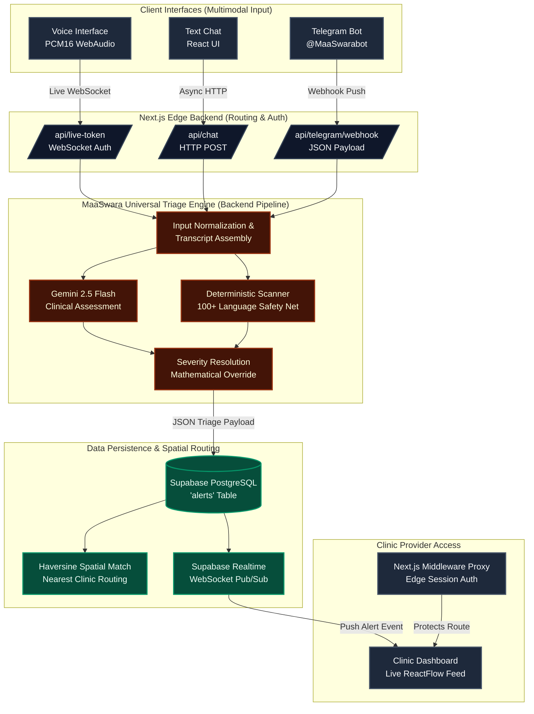

# 🤰 MaaSwara ▲
**A Mother's Voice: Multimodal AI Triage Engine for Low-Resource Maternal Healthcare**

Powered by Google Gemini 2.5 Flash Multimodal Intelligence

[Live Patient Web App](https://maa-swara.vercel.app) · [Telegram Bot @MaaSwarabot](https://t.me/MaaSwarabot) · [Live Provider Dashboard](https://maa-swara.vercel.app/clinic) *(Password: `maaswara2026`)*

`Next.js 16` `React 19` `Gemini Live API` `WebAudio` `Supabase` `Haversine Routing` `TypeScript` `CSS3` `Telegram Bot API`

---

## 💡 The Problem
Every two minutes, a woman dies during pregnancy or childbirth. Traditional healthcare systems rely on patients knowing when to seek help. But when a mother in a rural village experiences a symptom—like a severe headache or swollen hands—she often dismisses it as a normal part of pregnancy, entirely unaware that it is a classic, life-threatening sign of preeclampsia. 

The evidence is stark:
- **94%** of all maternal deaths occur in low and lower-middle-income countries.
- **80%** of these deaths are entirely preventable with timely clinical triage.
- **50%+** of fatal outcomes in rural settings are caused by the "Type 1 Delay" — the delay in deciding to seek care because the mother does not recognize the danger signs.
- Preeclampsia complications account for up to **15%** of direct maternal deaths globally, yet its symptoms are routinely ignored until seizures begin.

These aren't edge cases. They are systematic, evidence-backed gaps that occur globally every day — and they are solvable with accessible, voice-directed AI.

## 🧠 The Solution
What if an AI could listen to a mother in her native tongue, cross-reference her symptoms with World Health Organization (WHO) clinical guidelines, and instantly alert a nearby hospital if she is in danger—all without requiring her to type a single word or own a 5G smartphone?

MaaSwara is a full-stack, AI-powered maternal triage command center that:

- 🎙️ **Listens** to raw audio input via immersive Web Audio APIs or extreme low-bandwidth Telegram texts.
- 🧠 **Translates & Analyzes** across 100+ native languages (Hindi, Bengali, Tamil, Swahili, Yoruba, Hausa, Zulu, Amharic, and many more).
- 🔴 **Triages** symptoms into precise severity tiers (`GREEN`, `YELLOW`, `RED`).
- 🛡️ **Overrides** LLM hallucinations mathematically using a hardcoded deterministic keyword safety net.
- 🗺️ **Routes** `RED` alerts to the nearest geolocated partner clinic via Haversine spatial distance calculations.
- 🛠️ **Visualizes** live emergencies on a secure, glassmorphic Provider Dashboard.

---

## 🎯 What It Does [Intent ➡️ Action Mapping]
MaaSwara is continuously evaluating the patient's input. Here is exactly how the Universal Triage Engine handles real-world scenarios across different languages:

| Patient Input (Language) | AI Processing | Triage Action |
|---|---|---|
| *"Mujhe thoda dard hai, par theek lag raha hai"* (Hindi) | Gemini detects normal mild cramping, no danger signs. | **GREEN** - Responds with empathetic reassurance and basic care advice. |
| *"I have a very bad headache and my vision is blurry"* (English) | Scanner detects "headache" and "vision" (WHO Signs D6, D8). | **RED** - Overrides LLM. Instantly alerts nearest clinic dashboard. |
| *"Mo n ni orififo nla"* (Yoruba) | Gemini translates to severe headache. Scanner verifies danger intent. | **RED** - Dispatches alert to provider in Lagos. |
| *"Mtoto hachezi tumboni leo"* (Swahili) | Scanner detects decreased fetal movement (WHO Sign D10). | **YELLOW** - Flags for follow-up, advises immediate clinic visit. |

---

## 🏗️ Architecture



---

## ✨ Features & Engineering Decisions

### 🔄 Multimodal AI Ingestion Engine
Feed MaaSwara symptoms through 3 completely different input channels—all routed through the exact same Gemini-powered universal triage pipeline:

| # | Modality | Target Environment | How It Works |
|---|---|---|---|
| 1 | 🎙️ **Voice Duel** | High Bandwidth / Low Literacy | We implemented the **Gemini Multimodal Live API (v1beta)** over a secure WebSocket. The browser records raw audio, processes it via an `AudioWorkletNode`, converts it to `PCM16` base64, and streams it directly to the model. |
| 2 | 💬 **Web Chat** | Standard 4G / Normal Literacy | Clean, glassmorphic React interface calling standard Next.js Edge APIs. |
| 3 | 📲 **Telegram** | Extreme 2G / No Web Browser | A Next.js Webhook receives JSON payloads directly from Telegram. It bypasses web asset loading entirely, allowing mothers to text the AI using raw SMS-style bandwidth. |

### 🧩 Decoupled Adapters (WhatsApp & IVR Ready)
The MaaSwara Triage Engine is entirely decoupled from the frontend interfaces. The web app and Telegram bot are merely I/O adapters. An NGO with Meta Business verification could plug in a Twilio WhatsApp webhook (e.g., `/api/whatsapp/webhook`) or a telephone IVR system in a matter of hours, running native rural dialects through the exact same universal engine without rewriting any core logic.

### 💸 Model-Splitting Cost Strategy
To maximize performance while minimizing cost in low-resource deployments, MaaSwara splits its AI models across tiers:
- **Voice Interactions:** Exclusively routed to the heavy **Gemini Multimodal Live API (`gemini-2.5-flash-native-audio-latest`)** for real-time PCM audio streaming and barge-in support.
- **Text/Telegram Interactions:** Downgraded to the incredibly fast, standard **Gemini 2.5 Flash** text model, vastly reducing token expenditure for high-volume SMS traffic.

### 🤖 Dual-Layered AI Engine
Large Language Models are incredible at empathy and translation, but they hallucinate. In maternal healthcare, a hallucination means death. MaaSwara utilizes a strictly gated dual-layered engine:

| Agent / Layer | Role | Input | Output |
|---|---|---|---|
| 🧠 **Gemini 2.5 Flash** | Empathetic conversationalist & primary clinical classifier | Raw transcript | JSON: `{ severity, signs_detected }` |
| 🛡️ **Deterministic Scanner** | Hardcoded, regex-based medical safety net | Raw transcript + LLM English summary | Boolean trigger |

**Mathematical Override Logic**  
If the mother says "bleeding heavily" (Hindi: *bahut khoon*), the Deterministic Scanner flags it. Even if Gemini mistakenly classifies the bleeding as `GREEN`, the override formula kicks in:  
`Final Severity = max(LLM_Severity, Deterministic_Override)`  
*The patient is forced to `RED` and an ambulance is called.*

**100-Language Safety Net via `summary_en` Proxy Scanning**  
The Deterministic Scanner achieves 100+ language coverage through an elegant proxy technique: Gemini always outputs a `summary_en` field — an English translation of the patient's symptoms, regardless of the input language. The scanner runs its English keyword dictionary against this `summary_en` field, effectively inheriting Gemini's full multilingual fluency without needing regex dictionaries for every language.

### 🗺️ Geolocation & Haversine Clinic Routing
When a `RED` alert fires, the engine captures the patient's browser coordinates via `navigator.geolocation`. Using Haversine distance calculations, the backend computes the great-circle distance to every registered partner clinic and assigns the alert to the nearest facility (`clinic_id`) to guarantee rapid response times.

### 📊 Data Sources & Clinical Authority
MaaSwara's medical logic is not improvised; it is strictly grounded in established maternal health protocols:

| Asset | Source | Note |
|---|---|---|
| **Clinical Triage Logic** | *WHO Recommendations on Antenatal Care (2022)* | Hardcoded directly into the Gemini System Prompt context window. |
| **Danger Signs (11 Triggers)** | *JHPIEGO Maternal Health Manual* | 11 deterministic regex triggers that mathematically override the LLM. |
| **Partner Clinics** | *Synthetic Geolocation Seed Data* | Geofenced coordinates covering India, East Africa, and West Africa. |
| **Patient Record/Alerts** | *Synthetic FHIR-compliant Data* | No real patient PHI is used in this repository. |

---

## ⚔️ Technical Challenges Conquered
Building a multimodal, real-time medical app comes with brutal edge cases. Here is how we bypassed them:

1. **The Telegram Markdown Crash:** Gemini naturally outputs markdown (e.g., `**bold**`). Telegram's strict Markdown parser violently rejects this and throws `400 Bad Request` errors, causing silent delivery failures for emergency alerts. We had to strip the `parse_mode` requirement from our custom Telegram API client entirely, forcing raw text delivery to guarantee 100% reliability for rural mothers.
2. **Web Audio API Suspended Contexts:** Browsers strictly enforce auto-play policies. When building the Voice Call feature, the `AudioContext` would initialize in a "suspended" state, causing silent failures when Gemini tried to speak. We built an explicit user-interaction interceptor that forces `audioContext.resume()` upon the first tap of the pulsing orb, before initializing the WebSocket.
3. **Next.js Hydration Mismatches:** Browser extensions (like Grammarly) injecting DOM elements into the `<body>` caused catastrophic React hydration failures on the production build. We suppressed hydration warnings on the root layout to maintain absolute stability across diverse user browser environments.

---

## 🛠️ Tech Stack

| Layer | Technology | Purpose |
|---|---|---|
| **Frontend** | React 19 + Next.js 16 App Router | UI framework, SSR, and build system |
| **Styling** | Vanilla CSS3 Modules | Glassmorphism, terracotta color themes, custom animations |
| **AI Backend** | Gemini 2.5 Flash (`@google/genai`) | Clinical LLM parsing and conversational synthesis |
| **Voice Capture** | Web Audio API (`AudioWorkletNode`) | Raw PCM16 audio recording at 16kHz for Live API |
| **Voice Output** | Web Audio API (`AudioBufferSource`) | Real-time playback of Gemini's spoken responses |
| **Database** | Supabase PostgreSQL | Relational storage for live alerts and spatial data |
| **Realtime** | Supabase Realtime (WebSockets) | Instant push of `RED` alerts to the provider dashboard |
| **Security** | Next.js Edge Middleware (`proxy.ts`) | Route interception and cookie-based Auth for clinics |
| **Hosting** | Vercel | Global edge-network deployment |

---

## 🔒 Security & HIPAA Compliance
Because MaaSwara handles sensitive Protected Health Information (PHI), the Provider Dashboard is heavily locked down.

- 🌍 **Data Sovereignty (Zero-Retention Voice):** For Voice interactions, raw PCM16 audio is streamed via WebSocket and processed strictly in-memory by the Edge backend. **No audio files are ever saved, stored, or written to disk**, ensuring absolute privacy for patients.
- 🔑 **Edge Proxy Authentication:** The `/clinic` route is protected by a Next.js Middleware proxy. Unauthenticated requests never reach the server-rendering phase; they are intercepted at the edge and redirected.
- 🔐 **Cookie Cryptography:** Sessions are managed via strict `HttpOnly`, `Secure` cookies (`maaswara_clinic_auth`) dropped by Next.js Server Actions.
- 🛑 **API Key Origin Lockdown:** To prevent unauthorized consumption of the Gemini Live API, the API key is secured via Google Cloud Console using HTTP Referrer restrictions. It will only accept WebSocket connections originating from the official `https://maa-swara.vercel.app/*` domain.
- 🛡️ **Row Level Security (Production):** In enterprise deployments, every doctor receives a `clinic_id` JWT. Supabase PostgreSQL RLS policies mathematically restrict `SELECT` queries so doctors can *only* see alerts geofenced to their exact hospital (`alerts.clinic_id = auth.jwt().clinic_id`).

---

## 🚀 Getting Started

### Prerequisites
| Requirement | Note |
|---|---|
| Node.js v18+ | Required |
| Google Gemini API Key | Required for AI Triage |
| Supabase Project | Required for Realtime Alerts Database |

### Installation
```bash
# Clone the repository
git clone https://github.com/omshukla24/MaaSwara.git
cd MaaSwara

# Install dependencies
npm install

# Configure environment variables
cp .env.example .env.local
```

### Environment Configuration
Open `.env.local` and populate the following keys to unlock specific architecture modules:

**1. Triage Engine (Required)**
- `GEMINI_API_KEY`: Required for the core medical triage, text chat, and live voice engine. (Get it free at [Google AI Studio](https://aistudio.google.com/))

**2. Provider Dashboard & Routing (Required for Alerts)**
- `NEXT_PUBLIC_SUPABASE_URL`: Your Supabase project URL.
- `NEXT_PUBLIC_SUPABASE_ANON_KEY`: Public key for realtime WebSocket subscriptions.
- `SUPABASE_SERVICE_KEY`: Secure backend key required for Haversine geolocation routing.

**3. Telegram 2G Intake (Optional)**
- `TELEGRAM_BOT_TOKEN`: The token given to you by `@BotFather` on Telegram.
- `NEXT_PUBLIC_APP_URL`: Set to your ngrok URL or Vercel production URL (e.g., `https://maa-swara.vercel.app`) so the webhook can register itself automatically.

### Running the App
```bash
# Start development server
npm run dev
```
- **Patient Interface:** Visit `http://localhost:3000`
- **Clinic Dashboard:** Visit `http://localhost:3000/clinic` (Demo Password: `maaswara2026`)

---

## 🚀 What's Next
While MaaSwara currently serves as a highly functional triage bridge, our vision for scale includes:
1. **EHR / DHIS2 Integration:** Pushing FHIR-compliant triage data directly into **DHIS2**, the national health database standard used in 73 developing countries.
2. **Biometric Edge Integration:** Integrating with low-cost, Bluetooth-enabled maternal blood pressure cuffs to stream objective biometric data alongside the mother's voice.
3. **Automated Dispatch APIs:** Moving beyond clinical dashboards to API-level integration with local ambulance networks and ride-sharing systems (like Uber Health) for automated emergency dispatch in rural areas.
4. **WhatsApp Integration:** Building out a Twilio webhook adapter so mothers can interact with the exact same multimodal triage engine through WhatsApp, the most ubiquitous messaging app in the developing world.

---

## 📂 Project Structure
```text
MaaSwara/
├── app/
│   ├── (patient)/            # Public-facing interfaces
│   │   ├── call/page.tsx     # Immersive Web Audio UI
│   │   └── chat/page.tsx     # Text-based interface
│   ├── api/                  # Next.js Edge APIs
│   │   ├── live-token/       # WebSocket Auth handshake
│   │   ├── telegram/webhook/ # 2G Telegram intake
│   │   └── alerts/           # Realtime Supabase polling
│   └── clinic/               # Protected Provider Area
│       ├── page.tsx          # Realtime glassmorphic dashboard
│       └── login/            # Server Action auth gate
├── components/               # React UI Library
├── lib/
│   ├── gemini/               # Live Client & Chat utilities
│   ├── triage/               # Dual-layered medical engine
│   └── supabase/             # PostgreSQL clients
├── proxy.ts                  # Next.js 16 Edge Security Middleware
└── public/
    └── audio-processor.js    # Raw PCM16 AudioWorklet
```

---

## 🌍 Alignment & Support
This project was built for the **GNEC Hackathon** in direct support of **UN Sustainable Development Goal (SDG) 3.1**, which aims to reduce the global maternal mortality ratio. We acknowledge the civic and global organizations hosting and sponsoring this initiative, including the Global NGO Executive Committee (GNEC), World Assembly of Youth (WAY), and participating academic and international institutions.

---

🌌
*"Listen to the mother. Override the hallucination. Save the life."*

**MIT License**
