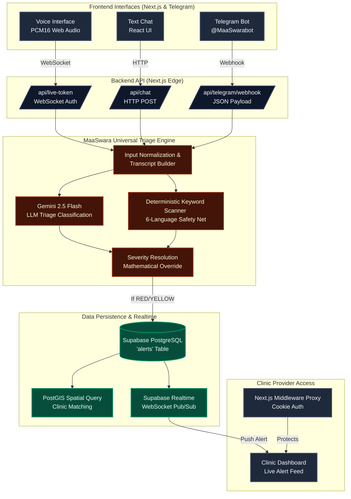

# MaaSwara: A Mother's Voice
**An AI-Powered Multilingual Antenatal Triage Engine for Low-Resource Environments.**

---

## 🌍 The Global Problem
Every two minutes, a woman dies during pregnancy or childbirth. Over 90% of these maternal deaths occur in low-resource and rural settings, and the vast majority are entirely preventable. 

The root cause is a catastrophic lack of immediate triage. When a mother in a rural village experiences a symptom—like a severe headache or swollen hands—she often dismisses it as a normal part of pregnancy, entirely unaware that it is a classic, life-threatening sign of preeclampsia. By the time she seeks help, it is often too late.

## 💡 The Solution: MaaSwara
MaaSwara (meaning "Mother's Voice") is a full-stack, multimodal AI triage platform designed to bridge the gap between rural mothers and professional healthcare clinics. 

It allows an expecting mother, regardless of her literacy level or internet connection, to interact with an AI in her native tongue. The AI processes her symptoms against **World Health Organization (WHO) clinical guidelines** and instantly flags urgent cases to a live, geolocated clinic dashboard.

### 🚀 Live Demo Access

| Interface | URL / Access | Description |
|---|---|---|
| **Patient Web App** | [https://maa-swara.vercel.app](https://maa-swara.vercel.app) | Main entry point for patients. Features Voice Call and Text Chat. |
| **Telegram Bot** | `@MaaSwarabot` | Low-bandwidth interface for 2G networks. No web browser required. |
| **Provider Dashboard** | [https://maa-swara.vercel.app/clinic](https://maa-swara.vercel.app/clinic) | Secure dashboard for clinic staff to monitor live incoming alerts. |

> **🔐 Demo Access Credentials**  
> To access the Provider Dashboard, use the demo authentication password: **`maaswara2026`**

---

## 🏗️ System Architecture

MaaSwara utilizes a unified triage engine that securely handles input from all channels, processes it through a strict dual-layered safety pipeline, and synchronizes critical alerts to the frontend via Supabase Realtime.



---

## ⚙️ Core Engine Mechanics

### 1. The Dual-Layered Triage Pipeline
Large Language Models are incredible at empathy and translation, but they are prone to hallucination. They cannot be trusted alone with life-or-death medical scenarios. MaaSwara solves this using a two-layered approach:

* **Layer 1 (The LLM):** The patient's input is passed to **Gemini 2.5 Flash** with a strict `SYSTEM_PROMPT` containing the 11 WHO Danger Signs of Pregnancy. The model responds with empathetic dialogue and a structured JSON block containing a `severity` rating (`GREEN`, `YELLOW`, `RED`) and an array of `signs_detected`.
* **Layer 2 (The Safety Net):** Every transcript is simultaneously scanned by a deterministic, hardcoded keyword engine across 6 languages. If a mother says "I am bleeding heavily," the deterministic scanner flags the word "bleeding". 

If the LLM hallucinates and marks the bleeding as `GREEN`, the mathematical override engine steps in and forces the severity to `RED`. 
**Formula:** `Final Severity = max(LLM_Severity, Deterministic_Override)`

### 2. Geolocation & Clinic Routing
When a `RED` alert is triggered, the engine calculates the Haversine distance between the patient's browser coordinates and our database of registered partner clinics. The alert is instantly assigned to the closest available clinic (`clinic_id`), ensuring rapid response times.

---

## 🌍 Multimodal Channels

MaaSwara is built to be accessible to everyone, regardless of hardware or connectivity.

| Channel | Interaction Mode | Target Environment | Tech Implementation |
|---|---|---|---|
| **Voice Duel** | Immersive Audio | High Bandwidth / Low Literacy | We implemented the **Gemini Multimodal Live API (v1beta)** over a secure WebSocket. The browser records raw audio, processes it via an `AudioWorkletNode`, converts it to `PCM16` base64, and streams it directly to the model. The model streams PCM16 audio back, which is played via the Web Audio API. |
| **Web Chat** | Text Interface | Medium Bandwidth | Standard React UI calling Next.js API Routes. |
| **Telegram Bot** | SMS-style Text | Extreme Low Bandwidth (2G) | A Next.js Webhook receives JSON payloads directly from the Telegram Bot API. It processes the text through the exact same universal Triage Engine as the web app, and responds via the Telegram `sendMessage` method. |

---

## 🔐 Security & HIPAA Compliance Architecture

Because MaaSwara handles Protected Health Information (PHI), the Provider Dashboard is strictly secured.

### Demonstration Setup (Current)
For the purpose of easy Vercel deployment and hackathon demonstration, the `/clinic` dashboard is protected by a **Next.js Edge Proxy (Middleware)**. 
Unauthenticated requests are intercepted at the edge and redirected to `/clinic/login`. The session is managed via a secure, HTTP-only cookie (`maaswara_clinic_auth`) initialized by a Next.js Server Action.

### Enterprise Production Setup (Future)
In a true hospital deployment, the middleware proxy integrates with an enterprise Identity Provider (IdP):
1. **SSO Integration:** Clinics authenticate via enterprise Identity Providers (Okta, Auth0) or Supabase Auth.
2. **Row Level Security (RLS):** Every authenticated doctor is assigned a `clinic_id` JWT claim. Supabase PostgreSQL RLS policies are strictly enforced at the database level so a clinic can *only* `SELECT` alerts geofenced to their specific facility (`alerts.clinic_id = auth.jwt().clinic_id`). Cross-clinic data leakage is impossible.

---

## ⚔️ Technical Challenges Conquered

1. **Telegram API Markdown Violations:** When deploying the webhook, we realized Gemini naturally outputs markdown (e.g., `**bold**`). Telegram's strict Markdown parser violently rejects this and throws `400 Bad Request` errors, causing silent delivery failures for emergency alerts. We had to strip the `parse_mode` requirement from the Telegram API client entirely, forcing raw text delivery to guarantee 100% reliability.
2. **Web Audio API Suspended Contexts:** Browsers strictly enforce auto-play policies. When building the Voice Call feature, the `AudioContext` would initialize in a "suspended" state, causing silent failures when Gemini tried to speak. We built an explicit user-interaction interceptor that forces `audioContext.resume()` upon the first tap of the pulsing orb, before initializing the WebSocket.
3. **Next.js Hydration Mismatches:** Browser extensions (like Grammarly) injecting DOM elements into the `<body>` caused catastrophic React hydration failures on the production build. We suppressed hydration warnings on the root layout to maintain stability across diverse user browser environments.

---

## 💻 Local Development Setup

1. **Clone the repository:**
   ```bash
   git clone https://github.com/omshukla24/MaaSwara.git
   cd MaaSwara
   ```
2. **Install dependencies:**
   ```bash
   npm install
   ```
3. **Configure Environment Variables:**
   Rename `.env.example` to `.env.local` and add your `GEMINI_API_KEY`, `TELEGRAM_BOT_TOKEN`, and Supabase credentials.
4. **Run the development server:**
   ```bash
   npm run dev
   ```
   Open [http://localhost:3000](http://localhost:3000) with your browser to see the result.
