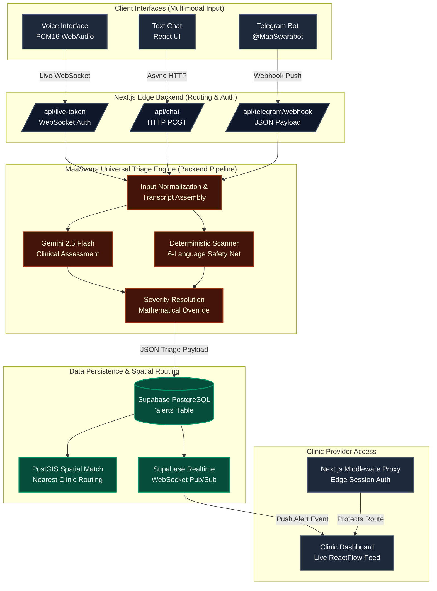

# 🤰 MaaSwara ▲
**A Mother's Voice: Multimodal AI Triage Engine for Low-Resource Maternal Healthcare**

Powered by Google Gemini 2.5 Flash Multimodal Intelligence

[Live Patient Web App](https://maa-swara.vercel.app) · [Telegram Bot @MaaSwarabot](https://t.me/MaaSwarabot) · [Live Provider Dashboard](https://maa-swara.vercel.app/clinic) *(Password: `maaswara2026`)*

`Next.js 14` `React` `Gemini Live API` `WebAudio` `Supabase` `PostGIS` `TypeScript` `CSS3` `Telegram Bot API`

---

## 💡 The Problem
Every two minutes, a woman dies during pregnancy or childbirth. Over 90% of these maternal deaths occur in low-resource and rural settings, and the vast majority are entirely preventable.

Traditional healthcare systems rely on patients knowing when to seek help. But when a mother in a rural village experiences a symptom—like a severe headache or swollen hands—she often dismisses it as a normal part of pregnancy, entirely unaware that it is a classic, life-threatening sign of preeclampsia. By the time she seeks help, it is often too late.

## 🧠 The Solution
What if an AI could listen to a mother in her native tongue, cross-reference her symptoms with World Health Organization (WHO) clinical guidelines, and instantly alert a nearby hospital if she is in danger—all without requiring her to type a single word or own a 5G smartphone?

MaaSwara is a full-stack, AI-powered maternal triage command center that:

- 🎙️ **Listens** to raw audio input via immersive Web Audio APIs or extreme low-bandwidth Telegram texts.
- 🧠 **Translates & Analyzes** across 6 native dialects (Hindi, Bhojpuri, Swahili, Yoruba, Hausa, English).
- 🔴 **Triages** symptoms into precise severity tiers (`GREEN`, `YELLOW`, `RED`).
- 🛡️ **Overrides** LLM hallucinations mathematically using a hardcoded deterministic keyword safety net.
- 🗺️ **Routes** `RED` alerts to the nearest geolocated partner clinic via Supabase PostGIS spatial queries.
- 🛠️ **Visualizes** live emergencies on a secure, glassmorphic Provider Dashboard.

---

## 🏗️ Architecture



---

## ✨ Features

### 🔄 Multimodal AI Ingestion Engine
Feed MaaSwara symptoms through 3 completely different input channels—all routed through the exact same Gemini-powered universal triage pipeline:

| # | Modality | Target Environment | How It Works |
|---|---|---|---|
| 1 | 🎙️ **Voice Duel** | High Bandwidth / Low Literacy | We implemented the **Gemini Multimodal Live API (v1beta)** over a secure WebSocket. The browser records raw audio, processes it via an `AudioWorkletNode`, converts it to `PCM16` base64, and streams it directly to the model. |
| 2 | 💬 **Web Chat** | Standard 4G / Normal Literacy | Clean, glassmorphic React interface calling standard Next.js Edge APIs. |
| 3 | 📲 **Telegram** | Extreme 2G / No Web Browser | A Next.js Webhook receives JSON payloads directly from Telegram. It bypasses web asset loading entirely, allowing mothers to text the AI using raw SMS-style bandwidth. |

### 🤖 Dual-Layered AI Engine
Large Language Models are incredible at empathy and translation, but they hallucinate. In maternal healthcare, a hallucination means death. MaaSwara utilizes a strictly gated dual-layered engine:

| Agent / Layer | Role | Input | Output |
|---|---|---|---|
| 🧠 **Gemini 2.5 Flash** | Empathetic conversationalist & primary clinical classifier | Raw transcript | JSON: `{ severity, signs_detected }` |
| 🛡️ **Deterministic Scanner** | Hardcoded, regex-based medical safety net | Raw transcript | Boolean trigger |

**Mathematical Override Logic**  
If the mother says "bleeding heavily" (Hindi: *bahut khoon*), the Deterministic Scanner flags it. Even if Gemini mistakenly classifies the bleeding as `GREEN`, the override formula kicks in:  
`Final Severity = max(LLM_Severity, Deterministic_Override)`  
*The patient is forced to `RED` and an ambulance is called.*

### 🗺️ Geolocation & PostGIS Clinic Routing
When a `RED` alert fires, the engine captures the patient's browser coordinates. Using Supabase PostGIS, the backend runs a spatial Haversine distance query against a database of registered partner clinics, instantly assigning the alert to the nearest facility (`clinic_id`) to guarantee rapid response times.

---

## 🛠️ Tech Stack

| Layer | Technology | Purpose |
|---|---|---|
| **Frontend** | React 19 + Next.js 14 App Router | UI framework, SSR, and build system |
| **Styling** | Vanilla CSS3 Modules | Glassmorphism, terracotta color themes, custom animations |
| **AI Backend** | Gemini 2.5 Flash (`@google/genai`) | Clinical LLM parsing and conversational synthesis |
| **Voice Capture** | Web Audio API (`AudioWorkletNode`) | Raw PCM16 audio recording at 16kHz for Live API |
| **Voice Output** | Web Audio API (`AudioBufferSource`) | Real-time playback of Gemini's spoken responses |
| **Database** | Supabase PostgreSQL | Relational storage for live alerts and spatial data |
| **Realtime** | Supabase Realtime (WebSockets) | Instant push of `RED` alerts to the provider dashboard |
| **Security** | Next.js Edge Middleware (`proxy.ts`) | Route interception and cookie-based Auth for clinics |
| **Hosting** | Vercel | Global edge-network deployment |

---

## 🔒 Security & HIPAA Compliance
Because MaaSwara handles sensitive Protected Health Information (PHI), the Provider Dashboard is heavily locked down.

- 🔑 **Edge Proxy Authentication:** The `/clinic` route is protected by a Next.js Middleware proxy. Unauthenticated requests never reach the server-rendering phase; they are intercepted at the edge and redirected.
- 🔐 **Cookie Cryptography:** Sessions are managed via strict `HttpOnly`, `Secure` cookies (`maaswara_clinic_auth`) dropped by Next.js Server Actions.
- 🛡️ **Row Level Security (Production):** In enterprise deployments, every doctor receives a `clinic_id` JWT. Supabase PostgreSQL RLS policies mathematically restrict `SELECT` queries so doctors can *only* see alerts geofenced to their exact hospital (`alerts.clinic_id = auth.jwt().clinic_id`).

---

## 🚀 Getting Started

### Prerequisites
| Requirement | Note |
|---|---|
| Node.js v18+ | Required |
| Google Gemini API Key | Required for AI Triage |
| Supabase Project | Required for Realtime Alerts Database |

### Installation
```bash
# Clone the repository
git clone https://github.com/omshukla24/MaaSwara.git
cd MaaSwara

# Install dependencies
npm install

# Configure environment variables
cp .env.example .env.local
# Add your GEMINI_API_KEY and Supabase credentials to .env.local

# Start development server
npm run dev
```
Visit `http://localhost:3000` — the web app will load. Visit `http://localhost:3000/clinic` to view the dashboard (Password: `maaswara2026`).

---

## 📂 Project Structure
```text
MaaSwara/
├── app/
│   ├── (patient)/            # Public-facing interfaces
│   │   ├── call/page.tsx     # Immersive Web Audio UI
│   │   └── chat/page.tsx     # Text-based interface
│   ├── api/                  # Next.js Edge APIs
│   │   ├── live-token/       # WebSocket Auth handshake
│   │   ├── telegram/webhook/ # 2G Telegram intake
│   │   └── alerts/           # Realtime Supabase polling
│   └── clinic/               # Protected Provider Area
│       ├── page.tsx          # Realtime glassmorphic dashboard
│       └── login/            # Server Action auth gate
├── components/               # React UI Library
├── lib/
│   ├── gemini/               # Live Client & Chat utilities
│   ├── triage/               # Dual-layered medical engine
│   └── supabase/             # PostgreSQL clients
├── proxy.ts                  # Next.js 16 Edge Security Middleware
└── public/
    └── audio-processor.js    # Raw PCM16 AudioWorklet
```

---

🌌
*"Listen to the mother. Override the hallucination. Save the life."*

**MIT License**
